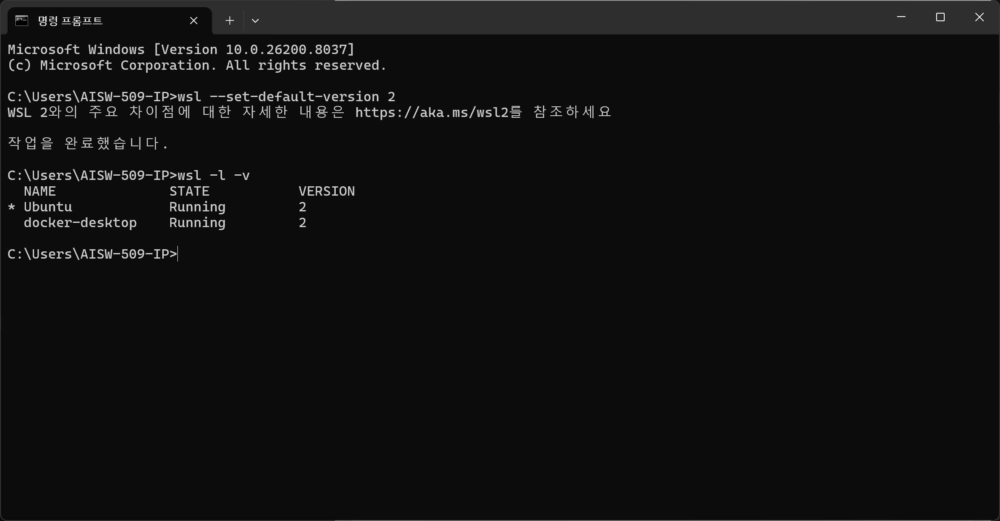

# WSL 이란?
- **Linux 용 window 하위 시스템** 으로 개발자가 기존 가상 머신의 오버헤드 또는 듀얼부팅 설정 없이 대부분의 명령줄 도구, 유틸리티 및 애플리케이션 등 GNU/Linux 환경을 수정하지 않고 Window 에서 직접 실행 가능하도록 하는 시스템
> WSL 2는 Windows 11 또는 Windows 10, 버전 1903, 빌드 18362 이상에서만 사용할 수 있고, Windows 로고키 + R을 선택하고 winver를 입력한 다음, 확인을 선택하여 Windows 버전을 확인 가능

# WSL 설치
1. WSL 설치
: PowerShell을 관리자 권한으로 실행
```
wsl --install 
```
> 설치 완료 후 재부팅 필요

2. WSL 버전 설정
```
wsl --set-default-version 2
```

3. WSL 설치 확인
```
wsl -l -v
```
