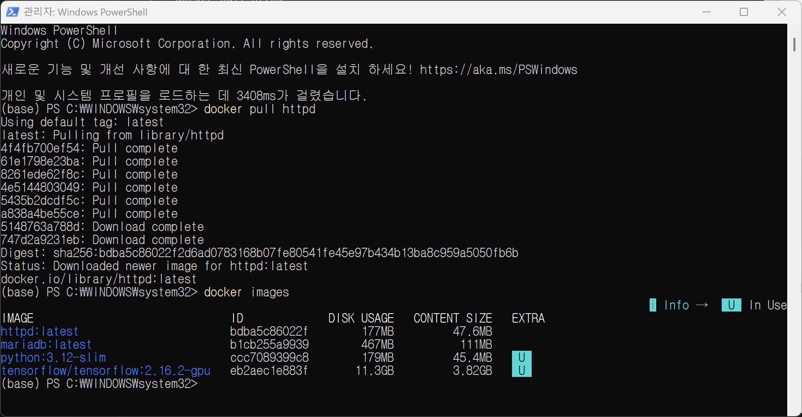
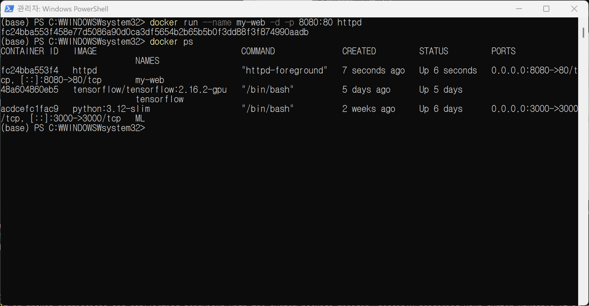
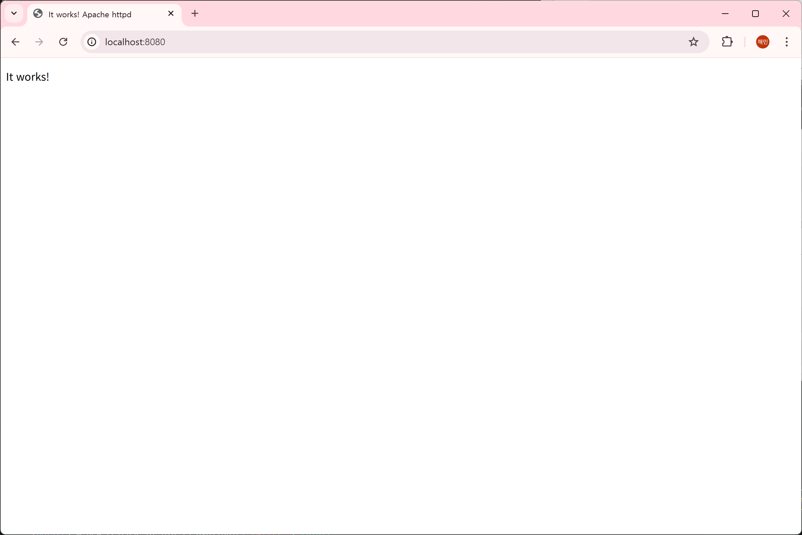
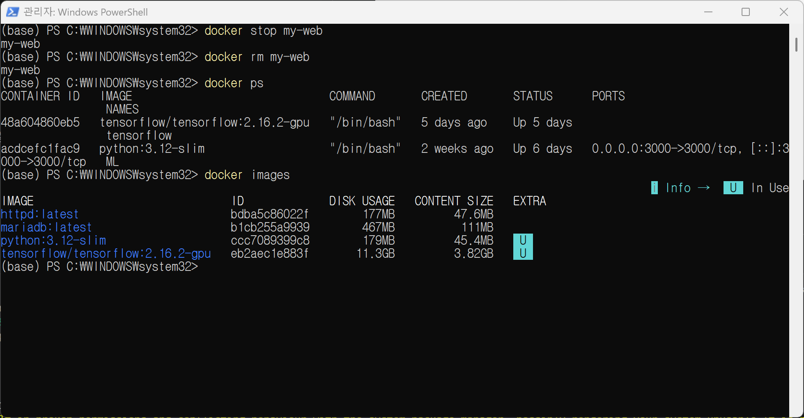
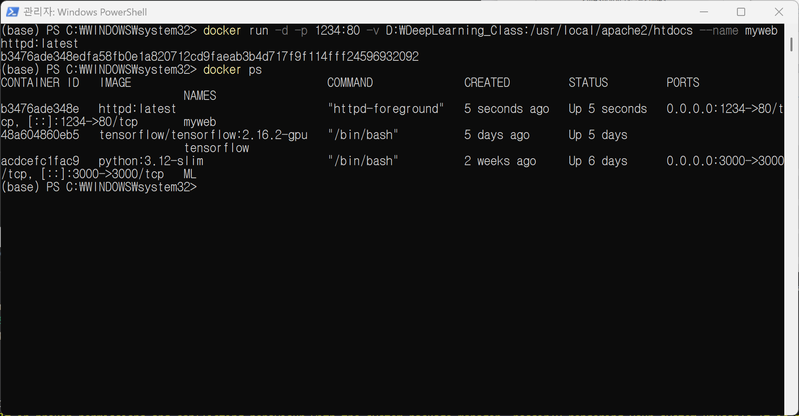
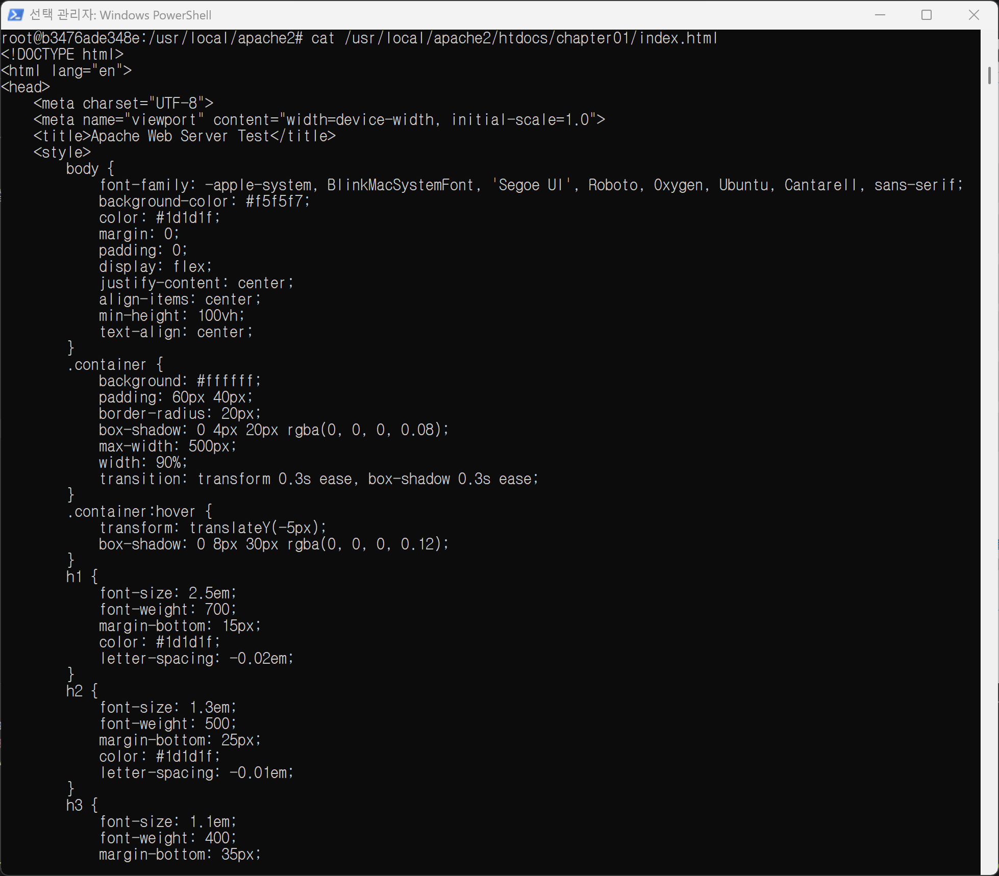
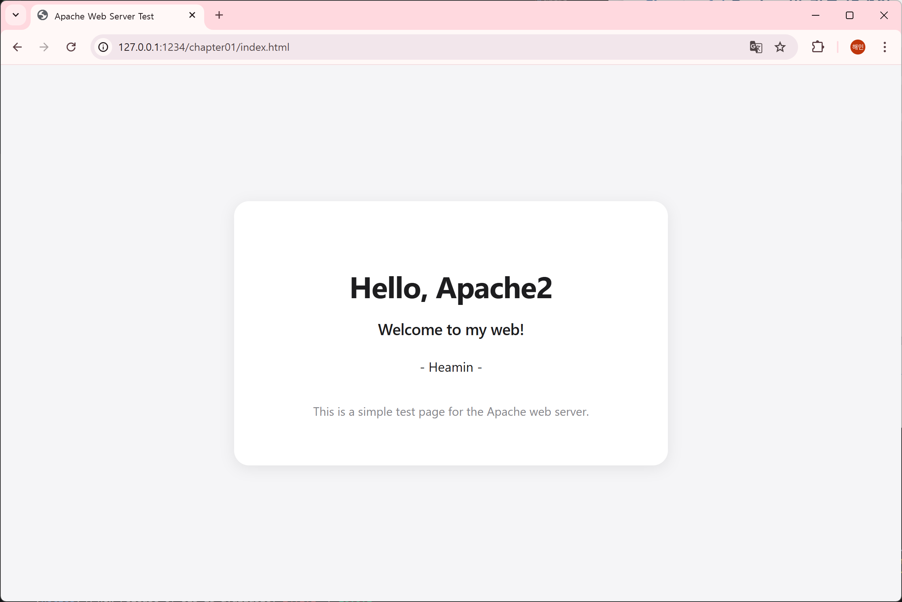

# 0. Apache 란?
: Apache HTTP Server는 Apache Software Foundation에서 관리하는 오픈 소스 크로스 플랫폼 웹 서버 소프트웨어로 개발 시 사용하는 라이브러리 집합인 '프레임워크'와 달리, 독립적으로 실행되어 클라이언트(브라우저)의 HTTP 요청을 처리하는 서버 엔지니어링 프로그램으로 분류

### 주요 기술적 특징
- **프로세스/스레드 기반 구조**: MPM(Multi-Processing Modules)을 통해 요청을 처리하며, 전통적으로 하나의 연결당 하나의 프로세스/스레드를 할당하는 방식을 사용
- **정적 컨텐츠 처리**: HTML, 이미지, JavaScript 등 정적 자원을 호스팅하는 데 최적화되어 있으며, 파일 시스템 경로를 URL 매핑을 통해 직접 서비스
- **확장성 (Module)**: mod_rewrite(URL 재작성), mod_ssl(보안), mod_proxy(대리 서버) 등 다양한 모듈을 동적으로 로드하여 기능을 확장할 수 있음.
- **설정 유연성**: .htaccess 파일을 통해 디렉토리별로 서버 설정을 제어할 수 있는 높은 유연성을 제공

# 1. Docker 테스트 Apache Web Server 준비

: docker 명령어 기본 구조 `docker [커맨드] [옵션] [대상] [인자]`

## 1-1. Apache 이미지 내려받기

: 웹 서버를 구동하기 위한 'httpd(Apache)' 이미지를 도커 허브로부터 가져옴

```
docker pull httpd
```

- `pull` : 이미지 다운로드 명령어
- `httpd` : 아파치 HTTP 서버의 이미지 이름

## 1-2.  내려받은 이미지 목록 확인

: 이미지가 내 컴퓨터에 정상적으로 저장되었는지 확인

```
docker images
```

- `images` : 현재 보관 중인 이미지 리스트 출력
- 출력 결과에서 REPOSITORY, TAG, IMAGE ID 확인 가능
  

# 2. Docker 컨테이너 생성 및 실행

: 내려받은 아파치(httpd) 이미지를 바탕으로 실제 웹 서버를 구동하는 단계

## 2-1. 컨테이너 생성 및 실행

: 도커 컨테이너를 실행하여 외부에서 접속 가능하도록 포트 연결

```
# 아파치 컨테이너를 'my-web'이라는 이름으로 백그라운드에서 실행함
# 호스트의 8080 포트를 컨테이너의 80 포트와 연결함
docker run --name my-web -d -p 8080:80 httpd
```

- `run` : 컨테이너를 생성하고 시작하는 통합 명령어
- `--name my-web`: 컨테이너에 식별하기 쉬운 이름을 부여
- `-d`: 백그라운드(Detached) 모드로 실행하여 터미널을 계속 사용할 수 있게 함
- `-p 8080:80` : 포트 포워딩 설정임. (외부에서 8080으로 접속하면 컨테이너 내부 80으로 연결됨. "통로연결"이라고 생각하면 편함)

## 2-2. 실행중인 컨테이너 확인

: 컨테이너가 정상적으로 동작하고 있는지 상태 확인

```
docker ps
```

- `ps` : 현재 가동중인 컨테이너 ID, 이름, 상태 포트 정보 등을 출력 (멈춰있는 컨테이너까지 보고 싶다면, docker ps -a) 사용
  

## 2-3. 웹 브라우저 접속 테스트

: http://127.0.0.1:8080 또는 http://localhost:8080 로 접속하여 브라우저 접속 테스트


# 3. Docker 컨테이너 중지 및 삭제

: 실습이 끝난 컨테이너를 정리하여 컴퓨터 자원을 회수하는 단계

## 3-1. 컨테이너 중지

: 현재 동작 중인 컨테이너를 안전하게 종료

```
docker stop myweb
```

- `stop` : 컨테이너 내부의 서비스를 종료

## 3-2. 컨테이너 삭제

: 정지된 컨테이너를 목록에서 완전히 제거

```
docker rm my-web
```

- `rm` : 정지된 컨테이너의 기록을 제거 (이미지가 삭제되는것은 아님)

## 3-3. 상태 확인

```
# 실행 중인 컨테이너 확인 (아무것도 안 나와야 함)
docker ps

# 보관 중인 이미지는 그대로 있는지 확인
docker images
```



# 4. 호스트 폴더 연결

: 내 컴퓨터에서 작성한 파일을 컨테이너가 실시간으로 읽을 수 있도록 연결 하는 설정

## 4-1. HTML 파일 작성

: index.html을 작성하여 저장 (/workspace/chapter01/index.html)

## 4-2. 볼륨 옵션을 조절하여 컨테이너 실행

: 작성한 피일이 저장된 폴더를 컨테이너의 웹 문서 경로와 연결하여 실행

```
# 내 컴퓨터의 D:\DeepLearning_Class 폴더를 컨테이너의 웹 서버 경로와 연결
docker run -d -p 1234:80 -v D:\DeepLearning_Class:/usr/local/apache2/htdocs --name myweb httpd:latest
```
  

# 5. 컨테이너 내부 접속 및 수정
: 실행 중인 컨테이너 내부로 직접 들어가서 명령어를 실행

## 5-1. 컨테이너 내부 쉘 접속
: 원격 컴퓨터에 로그인하듯 컨테이너 안으로 진입
```
# 실행 중인 'myweb' 컨테이너의 터미널(bash)에 접속함
docker exec -it myweb /bin/bash
```
- `exec`: 실행 중인 컨테이너에 명령어를 전달
- `-it`: 컨테이너와 상호작용(Interactive)하며 터미널(TTY)을 사용하겠다는 뜻

## 5-2. 컨테이너 내부 패키지 업데이트 및 설치
: 컨테이너 안은 아주 최소한의 기능만 존재하므로 필요한 도구 직접 설치 필요
```
# 패키지 목록 업데이트
apt-get update

# 텍스트 에디터(vim) 설치
apt-get install vim
```

## 5-3. 내부 파일 수정 및 확인
: 설치한 에디터로 파일을 수정하거나 내용을 확인
```
# 컨테이너 내의 chapter01안에 존재하는 index.html 내용 확인
cat /usr/local/apache2/htdocs/chapter01/index.html

# 접속 종료 (컨테이너는 계속 실행됨)
exit
```
  
> 현재는 DeepLearning_Class 폴더 전체를 연결해두었는데, chapter01의 내용만 연결하고 바로 보고 싶다면, `docker run -d -p 1234:80 -v D:\DeepLearning_Class\chapter01:/usr/local/apache2/htdocs --name myweb httpd:latest` 이렇게 처음부터 폴더를 지정하여 연결하면 됨

## 5-4. 웹 브라우저에 접속하여 확인 
주소: http://127.0.0.1:1234/chapter01/index.html
  