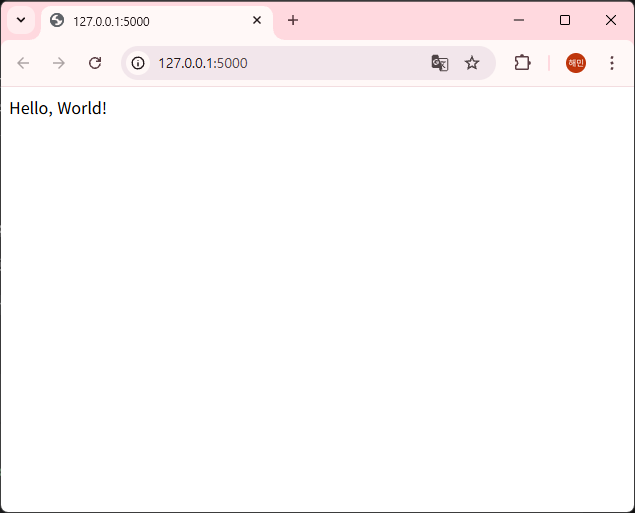
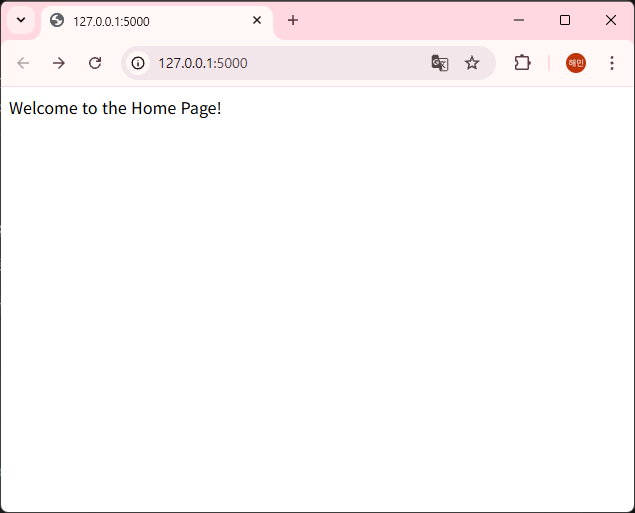
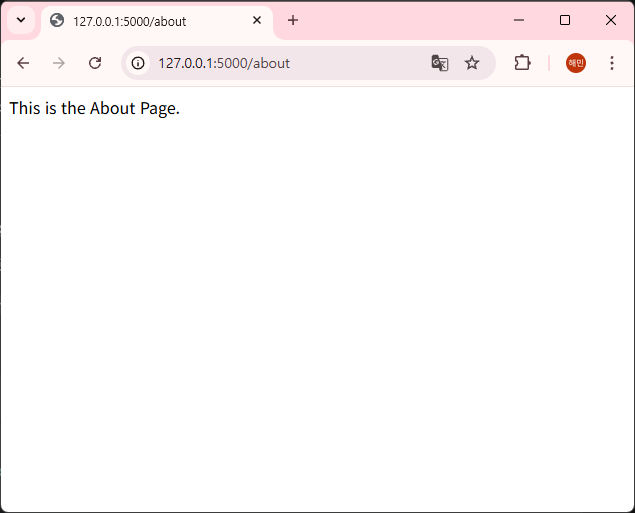
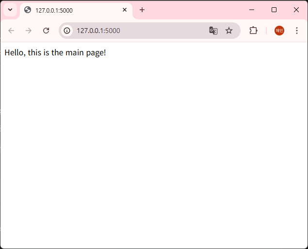
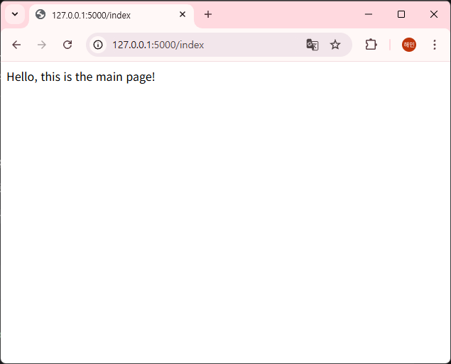
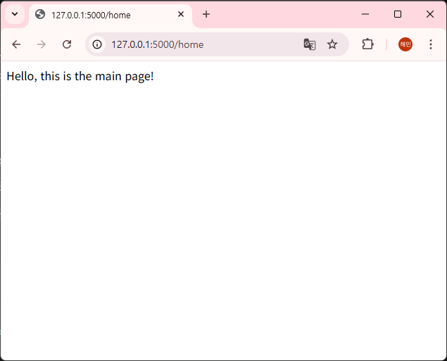

# 1. hello.py 로 fisrt test
: hello.py 를 생성하여 flask container 내부에서 windows 웹 브라우저에서 웹 확인

```
@app.route('/')
def hello():
    return 'Hello, World!'
```
  

# 2. oneroute.py 로 1:1 URL 매칭
: **하나의 함수에 하나의 URL 연결**  

```
@app.route('/') 
def home():
    return "Welcome to the Home Page!"

@app.route('/about') 
def about():
    return "This is the About Page."
```
  
  

# 3. multiroute.py 로 1:N URL 매칭
: **하나의 함수에 여러 URL 연결** = 사용자가 서로 다른 주소로 들어와도 동일한 화면이나 기능을 제공해야 할 때 사용하는 기술

```
@app.route('/') 
@app.route('/index') 
@app.route('/home')

def main():
    return "Hello, this is the main page!"
```

  
  
  
