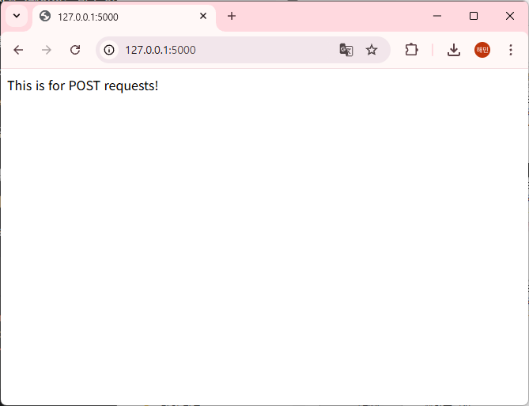
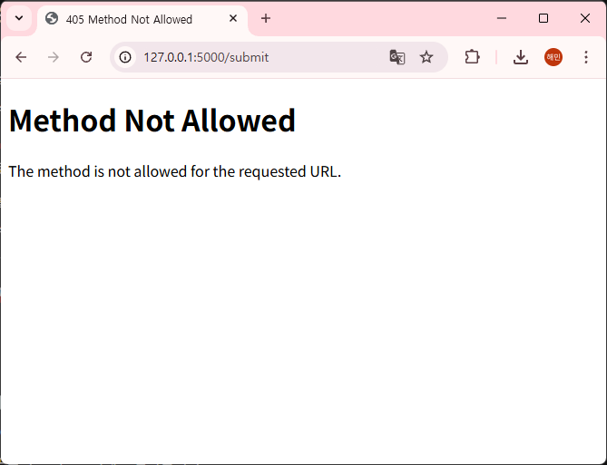
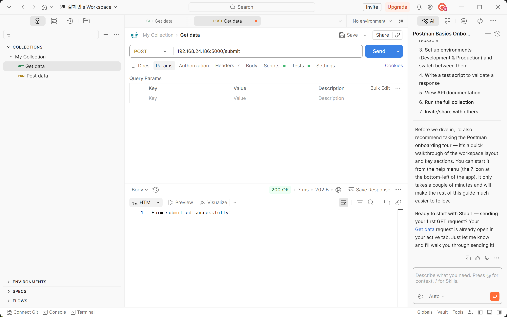

# 1. method.py 로 HTTP 메서드 지정
- **기본** : Flask 는 별도의 설정이 없다면 기본적으로 GET 요청만 허용
- **메서드 확장** : `methods` 옵션을 사용하면, POST, PUT 등 다양한 HTTP 메서드를 지정하여 서버가 처리할 수 있도록 제작 가능
- **Postman** : 웹 브라우저는 주소창에 URL을 입력할 때 보통 GET 방식만 사용하므로, 위에서 만든 POST /submit 경로를 테스트하려면 전용 도구가 필요하기 때문에 사용하는 API 플랫폼
>공식 웹사이트(https://www.postman.com/downloads/)에서 설치 가능

```
@app.route('/submit', methods=['POST']) 
def submit():
    return "Form submitted successfully!"
```
  
  
  > 웹에서 접속하니 Method 가 허용되지 않는다는 에러를 확인 가능.

  
  > postman 에 서버 주소를 넣고 POST 요청이 온 내역을 확인 하면 정상적으로 요청이 반환된 것을 확인 가능

# 2. GET 요청만 지원하는 이유
: 웹 브라우저의 본래 목적은 서버에 있는 정보를 가져오는것 이기 때문
- **단순성** : 주소창에 URL을 치고 엔터를 누르는 행위 자체가 정보를 요청하는 것이므로 브라우저는 기본적으로 GET 방식으로 설계됨
- **캐싱** : GET 요청은 결과값을 브라우저에 저장해둘 수 있어 다음에 같은 페이지를 볼 때 더 빠르게 로드 가능
- **북마크** : 특정 검색 결과나 페이지를 즐겨찾기하려면 주소창에 모든 정보가 담겨야 하는데 이것이 GET 방식의 특징

# 3. 타 메서드 사용 이유
: GET 방식만으로 해결 불가한 한계를 해결하기 위해 사용
### 1. 보안과 데이터 노출
- `GET` : 데이터를 URL 끝에 붙여서 보내 주소창에 비밀번호가 그대로 노출되고 히스토리도 남음
- `POST` : 데이터를 주소창이 아닌 요청 본문(body) 에 숨겨서 보내 비밀번호나 개인정보를 보낼 때는 반드시 POST 사용

### 2. 데이터 용량의 제한
- `GET` : 주소창의 길이는 제한적이라 긴 글이나 이미지 첨부 불가
- `POST`: 이론적으로 데이터 용량의 제한이 거의 없어 큰 파일 로드 시 필수

### 3. 서버의 상태 변경 
- `GET` : 데이터를 조회할 때만 사용 
- `POST`: 새로운 글을 쓰거나 데이터를 생성할 때 사용
- `PUT/DELETE` : 기존 데이터를 수정하거나 삭제할 때 사용

# 4. 웹 브라우저에서 POST 요청을 보내는 방법
: postman 같은 전문 도구가 없어도 웹 브라우저 내에 다음과 같은 경로로 POST 요청을 보내고 결과 확인 가능

### 1. HTML 의 `<form>` 태그
:웹 페이지에 있는 로그인, 글쓰기, 회원가입 버튼들이 주로 이 방식 사용
- **동작** : 사용자가 버튼을 누르면 브라우저가 데이터를 body에 담아 서버로 POST 요청을 보냄
- **결과** : 서버가 처리를 완료하고 보내주는 응답(문자열, HTML)은 브라우저 화면에 그대로 출력

### 2. 브라우저 개발자 도구 (F12)
: 네트워크 탭을 활용하여 현재 페이지에서 일어나는 모든 통신을 감시하기 때문에 특정 요청을 클릭하면 어떤 요청에 어떤 데이터를 보냈고 어떤 응답을 받았는지 확인 가능