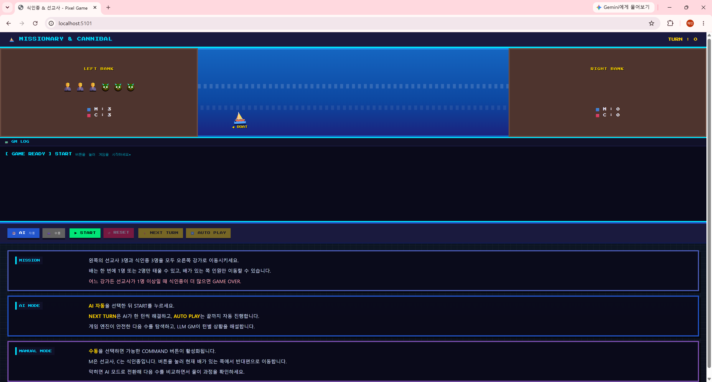
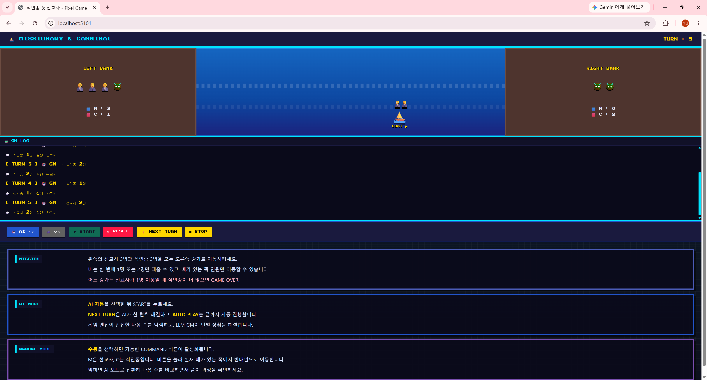
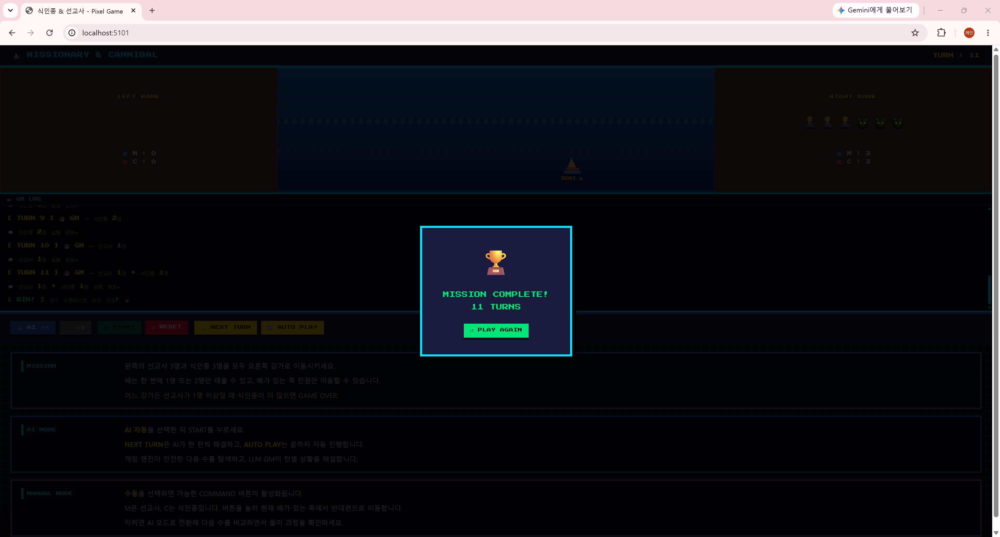

# LLM 기반 식인종-선교사 GM 및 문제해결 AI 협업 웹 프로그램

## 1. 과제 개요

| 구분 | 내용 |
|---|---|
| 능력단위 | 인공지능 모델 선정 |
| 능력단위 코드 | 2001070307_19v1 |
| 능력단위 요소 | 인공지능 모델 평가기준 정하기, 인공지능모델 선정기준 정하기, 인공지능학습결과 검증하기, 인공지능 최적화 모델 선정하기 |
| 평가방법 | 서술형 |
| 요구사항 | LLM을 이용하여 식인종-선교사게임을 진행하는 GM 또는 문제해결 AI협업 웹 프로그램을 작성하고, 전체 구성도, AI 활용방법, 스크린샷을 첨부한다. |

본 프로젝트는 고전적인 식인종-선교사 강 건너기 문제를 단순 퍼즐 게임으로 구현하는 데서 끝나지 않고, 사용자가 한 턴씩 AI와 협업하면서 문제를 해결할 수 있는 웹 프로그램으로 구현하였다.

일반적인 식인종-선교사 게임은 사용자가 모든 규칙과 풀이 순서를 직접 알고 있어야 한다. 본 구현에서는 사용자가 직접 플레이하는 수동 모드와, AI가 다음 턴을 제안하고 진행하는 AI 자동 모드를 함께 제공하였다. 사용자는 게임 도중 막히는 경우 AI 모드로 전환하여 다음 이동을 비교할 수 있고, AI가 선택한 턴과 GM 해설을 보면서 풀이 과정을 이해할 수 있다.

또한 화면에서는 단순히 숫자만 바뀌는 것이 아니라, 선교사와 식인종 캐릭터가 강가에 배치되고, 선택된 인원이 실제 보트에 탑승한 뒤 강을 건너는 것처럼 애니메이션을 구현하였다. 이를 통해 AI가 진행하는 턴을 시각적으로 확인할 수 있는 게임형 인터페이스를 완성하였다.

## 2. 전체 구성도

```text
사용자 브라우저
  |
  | 1. START / NEXT TURN / AUTO PLAY / COMMAND 클릭
  v
Flask 웹 서버
  |
  | /api/start
  | /api/ai_turn
  | /api/manual_turn
  v
게임 엔진
  |
  | 상태(Status) 관리
  | 가능한 커맨드 계산
  | 이동 후 판정(gameover / continue / win)
  v
AI 문제해결 모듈
  |
  | 안전한 커맨드 필터링
  | BFS 기반 승리 경로 탐색
  v
Ollama LLM GM
  |
  | 현재 턴 결과 해설
  | GM 역할의 자연어 피드백 생성
  v
웹 UI
  |
  | 보트 이동 애니메이션
  | 탑승자 표시
  | GM LOG 출력
```

구성의 핵심은 게임 규칙을 담당하는 게임 엔진과, 사용자와 상호작용하는 LLM GM을 분리한 점이다. 게임 엔진은 정확한 상태 전이와 규칙 판정을 담당하고, LLM은 사용자가 이해하기 쉬운 방식으로 턴별 상황을 설명하는 GM 역할을 수행한다.

## 3. 구현 기능

### 3.1 게임 규칙 구현

게임 상태는 왼쪽 강가의 선교사 수, 왼쪽 강가의 식인종 수, 오른쪽 강가의 선교사 수, 오른쪽 강가의 식인종 수, 배 위치로 구성하였다.

사용 가능한 커맨드는 다음 5개이다.

| 번호 | 커맨드 |
|---|---|
| 0 | 선교사 1명 이동 |
| 1 | 선교사 2명 이동 |
| 2 | 식인종 1명 이동 |
| 3 | 식인종 2명 이동 |
| 4 | 선교사 1명 + 식인종 1명 이동 |

판정 조건은 다음과 같다.

- 오른쪽에 선교사 3명과 식인종 3명이 모두 이동하면 성공
- 어느 강가든 선교사가 1명 이상 있을 때 식인종 수가 선교사 수보다 많으면 실패
- 그 외의 경우는 계속 진행

### 3.2 수동 모드

수동 모드는 사용자가 직접 커맨드를 선택하여 퍼즐을 푸는 방식이다.

수동 모드에서는 현재 배가 있는 쪽에서 실행 가능한 커맨드만 버튼으로 활성화된다. 예를 들어 배가 왼쪽에 있으면 왼쪽 강가에 있는 인원만 태울 수 있고, 배가 오른쪽에 있으면 오른쪽 강가에 있는 인원만 태울 수 있다.

수동 모드는 사용자가 직접 시행착오를 겪으며 문제를 이해하는 학습 모드에 해당한다. 사용자는 게임오버가 발생하는 이유를 직접 확인할 수 있고, 막히는 경우 AI 모드로 전환하여 다음 수를 비교할 수 있다.

### 3.3 AI 자동 모드

AI 자동 모드는 사용자가 AI와 협업하여 퍼즐을 해결하는 기능이다.

AI 모드에는 두 가지 실행 방식이 있다.

| 버튼 | 기능 |
|---|---|
| NEXT TURN | AI가 현재 상태에서 다음 한 턴만 진행 |
| AUTO PLAY | AI가 승리까지 자동으로 턴을 연속 진행 |

AI 모드는 단순히 LLM에게 아무 커맨드나 고르게 하는 방식이 아니다. 식인종-선교사 문제는 규칙 위반 시 바로 게임오버가 발생하므로, LLM의 환각이나 잘못된 선택을 그대로 실행하면 안정적인 문제해결이 어렵다.

따라서 본 구현에서는 다음과 같은 AI 협업 구조를 사용하였다.

1. 게임 엔진이 현재 상태에서 실행 가능한 커맨드를 계산한다.
2. 즉시 게임오버가 되는 위험한 커맨드를 제외한다.
3. BFS 탐색으로 승리까지 이어지는 경로의 다음 커맨드를 찾는다.
4. 선택된 커맨드를 실행한다.
5. LLM은 GM 역할로 현재 턴의 상황을 자연어로 해설한다.

이 구조를 통해 AI는 퍼즐을 안정적으로 해결하고, 사용자는 로그를 통해 AI가 어떤 선택을 했는지 한 턴씩 확인할 수 있다.

## 4. AI 활용 방법

### 4.1 사용 모델

본 프로젝트에서는 로컬 Ollama 환경의 `gemma4:e2b` 모델을 사용하였다.

| 항목 | 내용 |
|---|---|
| 모델 실행 환경 | Ollama 컨테이너 |
| 사용 모델 | gemma4:e2b |
| 호출 방식 | LangChain `ChatOllama` |
| 활용 목적 | GM 역할의 상황 해설 및 커맨드 선택 보조 |
| 장점 | 로컬 실행 가능, API 비용 없음, Docker 실습 환경과 연동 가능 |

### 4.2 모델 선정 기준

본 과제의 목적은 대규모 모델의 성능 비교보다는, LLM을 실제 웹 프로그램 안에 연결하여 AI 협업 기능을 구현하는 것이다. 따라서 모델 선정 기준은 다음과 같이 정하였다.

| 평가 기준 | 선정 이유 |
|---|---|
| 로컬 실행 가능성 | 실습 환경에서 외부 API 키 없이 실행 가능해야 함 |
| 응답 속도 | 턴 단위 게임 진행에 사용할 수 있을 정도로 빠른 응답 필요 |
| 한국어 응답 가능성 | GM 해설을 한국어로 제공해야 함 |
| LangChain 연동성 | Flask 서버에서 체인 형태로 호출하기 쉬워야 함 |
| 자원 사용량 | RTX 3080 및 로컬 Docker 환경에서 실행 가능해야 함 |

위 기준에 따라 `gemma4:e2b`를 선정하였다. 약 5B급 경량 모델은 초대형 모델에 비해 추론 품질은 제한될 수 있으나, 로컬 실습 환경에서 빠르게 실행할 수 있고 과제용 GM 해설 생성에는 충분하다고 판단하였다. 또한 현재 Ollama 컨테이너에 실제 설치되어 있는 모델과 보고서의 사용 모델을 일치시켜 재현성을 높였다.

### 4.3 프롬프트 설계

LLM은 식인종-선교사 게임의 GM 역할을 수행하도록 시스템 프롬프트를 구성하였다. 프롬프트에는 게임 규칙, 커맨드 번호, 출력 제한 조건을 포함하였다.

핵심 프롬프트는 다음과 같다.

```python
SYSTEM_PROMPT = """당신은 식인종-선교사 강 건너기 게임의 GM입니다.

[게임 규칙]
- 왼쪽 강가의 선교사 3명, 식인종 3명을 배로 모두 오른쪽으로 옮기면 승리
- 배는 한 번에 최대 2명 탑승, 배가 있는 쪽 인원만 태울 수 있음
- 어느 쪽이든 선교사가 1명 이상인데 식인종보다 적으면 게임오버

[커맨드 번호]
0: 선교사 1명
1: 선교사 2명
2: 식인종 1명
3: 식인종 2명
4: 선교사 1명 + 식인종 1명

반드시 실행 가능한 커맨드 번호 중 하나만 숫자로 답하세요. 다른 말은 하지 마세요."""
```

또한 턴별 해설을 위해 별도의 GM 해설 프롬프트를 사용하였다.

```python
comment_prompt = ChatPromptTemplate.from_messages([
    ("system", "당신은 식인종-선교사 게임 해설자입니다. 한 문장으로 짧게 상황을 설명하세요."),
    ("human", "{situation}"),
])
```

이 프롬프트를 통해 LLM은 게임 상태를 바탕으로 현재 턴의 결과를 사용자가 이해하기 쉬운 말로 설명한다.

## 5. AI 협업 게임 방식

본 프로그램의 핵심은 “AI가 대신 풀어주는 게임”이 아니라, “사용자가 AI와 함께 한 턴씩 문제를 해결하는 게임”이다.

사용자는 다음과 같은 방식으로 AI와 협업한다.

1. 사용자가 직접 수동 모드로 커맨드를 선택한다.
2. 게임오버가 발생하거나 다음 수가 어려워지면 AI 모드로 전환한다.
3. AI가 다음 턴을 제안하고 실행한다.
4. GM LOG에서 AI가 선택한 커맨드와 해설을 확인한다.
5. 다시 수동으로 이어가거나 AUTO PLAY로 전체 풀이를 확인한다.

이 방식은 문제해결형 AI 협업 구조에 가깝다. 사용자는 AI의 선택을 단순히 결과로만 보는 것이 아니라, 턴별 로그와 화면 애니메이션을 통해 AI가 어떤 행동을 했는지 확인한다. 즉, AI가 게임의 보조자이자 GM으로 동작한다.

## 6. 핵심 구현 내용

### 6.1 안전한 커맨드 필터링

LLM은 자연어 처리에는 강하지만, 퍼즐의 모든 상태 전이를 항상 정확히 계산한다고 보장할 수 없다. 따라서 먼저 게임 엔진이 규칙 위반 여부를 검사하도록 하였다.

```python
def get_safe_commands(status, visited=None):
    visited = set(visited or [])
    safe = []
    revisit = []
    for cmd_id in get_valid_commands(status):
        next_status = game(status, cmd_id)
        if next_status is None or judge(next_status) == "gameover":
            continue
        if next_status.to_tuple() in visited:
            revisit.append(cmd_id)
        else:
            safe.append(cmd_id)
    return safe or revisit
```

### 6.2 승리 경로 탐색

AI 모드에서는 BFS 탐색을 사용하여 현재 상태에서 승리까지 이어지는 경로의 첫 커맨드를 찾는다. 이를 통해 AI가 안정적으로 퍼즐을 해결할 수 있도록 하였다.

```python
def find_solution_command(status, visited=None):
    visited = set(visited or [])
    start = status.to_tuple()
    queue = [(status, [])]
    seen = {start}

    while queue:
        cur, path = queue.pop(0)
        for cmd_id in get_valid_commands(cur):
            next_status = game(cur, cmd_id)
            if next_status is None or judge(next_status) == "gameover":
                continue

            next_key = next_status.to_tuple()
            if next_key in seen:
                continue
            seen.add(next_key)

            next_path = path + [cmd_id]
            if judge(next_status) == "win":
                return next_path[0]

            queue.append((next_status, next_path))
```

### 6.3 AI 턴 실행

Flask 서버의 `/api/ai_turn`에서는 현재 상태를 읽고, 안전한 다음 수를 계산한 뒤, LLM GM 해설을 생성하여 브라우저에 반환한다.

```python
safe_commands = get_safe_commands(status, visited)
cmd_id = find_solution_command(status, visited)
if cmd_id is None:
    cmd_id = gm_select_command(status, safe_commands or valid)
cmd_name = COMMAND_NAMES[cmd_id]

next_status = game(status, cmd_id)
result = judge(next_status)
comment = gm_comment(next_status, cmd_name, result)
```

이 구조에서 AI 문제해결 모듈은 다음 행동을 안정적으로 선택하고, LLM은 GM 해설을 담당한다.

### 6.4 게임 UI 애니메이션

UI에서는 커맨드 실행 시 선택된 인원이 실제 보트에 탑승하도록 구현하였다. 예를 들어 `식인종 2명` 커맨드가 실행되면 식인종 캐릭터 2명이 보트 위에 표시되고, 보트가 반대편으로 이동한 뒤 강가 상태가 갱신된다.

```javascript
const COMMAND_LOADS = {
  0: { m: 1, c: 0 },
  1: { m: 2, c: 0 },
  2: { m: 0, c: 1 },
  3: { m: 0, c: 2 },
  4: { m: 1, c: 1 },
};

function animateBoatMove(cmdId, targetSide, done) {
  const startSide = currentBoatSide;
  setBoat(startSide);
  setBoatPassengers(cmdId);
  window.setTimeout(() => setBoat(targetSide), 80);
  window.setTimeout(done, 1080);
}
```

이를 통해 사용자는 AI가 선택한 커맨드가 실제 게임 화면에서 어떻게 수행되는지 직관적으로 확인할 수 있다.

## 7. 테스트 및 검증

### 7.1 AI 자동 풀이 검증

AI 모드에서 `AUTO PLAY`를 실행하면 다음 순서로 게임을 해결한다.

```text
TURN 1: 식인종 2명
TURN 2: 식인종 1명
TURN 3: 식인종 2명
TURN 4: 식인종 1명
TURN 5: 선교사 2명
TURN 6: 선교사 1명 + 식인종 1명
TURN 7: 선교사 2명
TURN 8: 식인종 1명
TURN 9: 식인종 2명
TURN 10: 선교사 1명
TURN 11: 선교사 1명 + 식인종 1명
RESULT: WIN
```

이 결과를 통해 AI가 게임오버 없이 승리 조건까지 도달하는 것을 확인하였다.

### 7.2 검증 기준

| 검증 항목 | 결과 |
|---|---|
| 게임 시작 시 초기 상태 표시 | 정상 |
| 수동 모드 커맨드 버튼 활성화 | 정상 |
| AI 모드 한 턴 진행 | 정상 |
| AI 자동 진행으로 승리 도달 | 정상 |
| 게임오버 판정 | 정상 |
| 보트 탑승자 표시 및 이동 애니메이션 | 정상 |
| GM LOG 출력 | 정상 |

## 8. 스크린샷 첨부 위치

아래 위치에 실행 화면 스크린샷을 첨부한다.

### 8.1 초기 화면

첨부할 내용: 게임 시작 전, 왼쪽 강가에 선교사 3명과 식인종 3명이 배치되어 있고, 하단에 MISSION, AI MODE, MANUAL MODE 설명이 보이는 화면.



### 8.2 AI 진행 화면

첨부할 내용: AI 모드에서 `NEXT TURN` 또는 `AUTO PLAY`를 실행하여 보트에 선교사 또는 식인종이 탑승하고 이동하는 화면. GM LOG에 AI가 선택한 커맨드와 해설이 표시되어야 한다.



### 8.3 승리 화면

첨부할 내용: 모든 선교사와 식인종이 오른쪽 강가로 이동하고, `MISSION COMPLETE` 또는 승리 메시지가 표시된 화면.



## 9. 결론

본 프로젝트는 식인종-선교사 퍼즐을 LLM 기반 GM 및 문제해결 AI 협업 웹 프로그램으로 구현하였다.

기존 퍼즐 게임은 사용자가 정답을 직접 찾아야 하지만, 본 프로그램은 사용자가 직접 플레이하면서 필요한 순간 AI의 도움을 받을 수 있도록 구성하였다. AI는 안전한 다음 수를 탐색하여 제안하고, LLM은 GM처럼 턴별 상황을 해설한다. 사용자는 AI가 선택한 행동을 GM LOG와 보트 이동 애니메이션으로 확인할 수 있다.

따라서 본 구현은 단순한 규칙 기반 게임이 아니라, 게임 엔진, 문제해결 AI, LLM GM, 시각적 UI가 결합된 AI 협업형 웹 프로그램이다. 이를 통해 인공지능 모델 선정 기준, AI 활용 방식, 학습 결과 검증, 최적화 모델 선정 과정을 하나의 실습 결과물로 제시할 수 있다.
