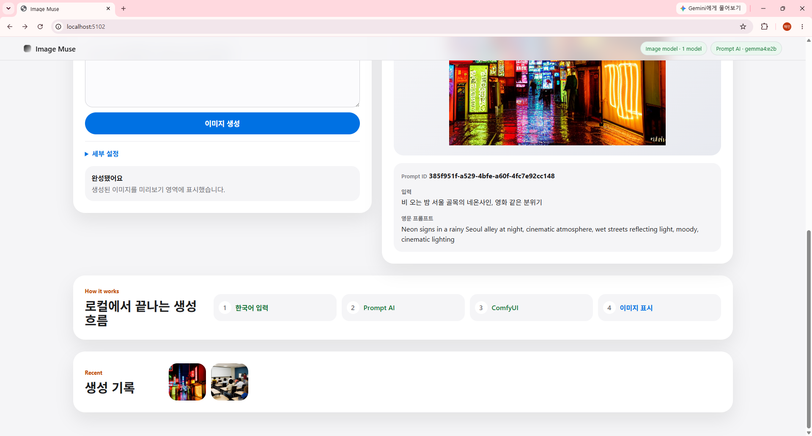
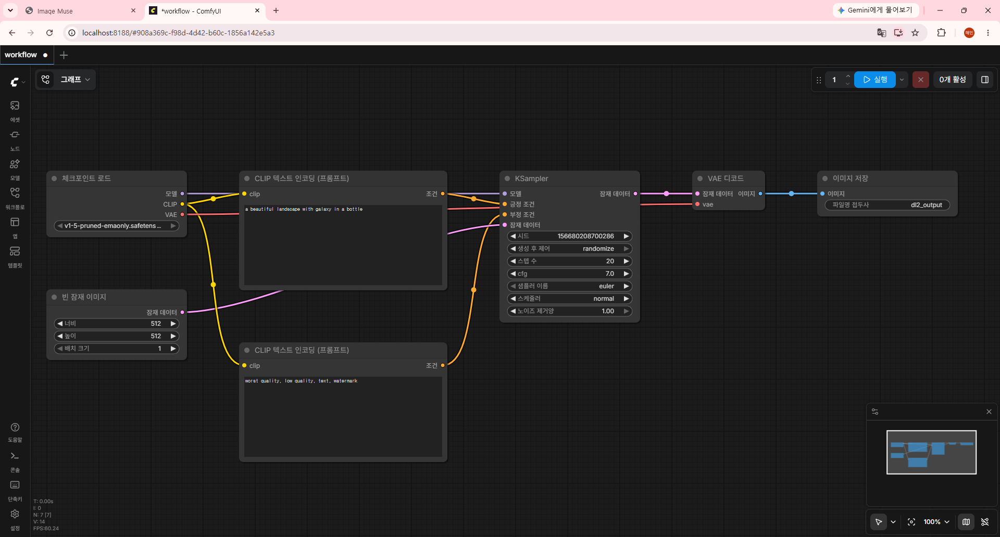

# Image Muse: ComfyUI API 기반 한글 프롬프트 이미지 생성 챗봇

## 1. 과제 개요

| 구분 | 내용 |
|---|---|
| 능력단위 | 인공지능 모델 선정 |
| 능력단위 코드 | 2001070307_19v1 |
| 능력단위 요소 | 인공지능 모델 평가기준 정하기, 인공지능모델 선정기준 정하기, 인공지능학습결과 검증하기, 인공지능 최적화 모델 선정하기 |
| 평가방법 | 서술형 |
| 요구사항 | ComfyUI의 API를 이용하여 Local에서 한글로 작성된 프롬프트를 영문으로 자동 번역하여 이미지를 생성하는 웹 프로그램을 작성하고, 전체 구성도, AI 활용방법, 스크린샷을 첨부한다. |

본 과제는 `Image Muse`라는 실제 서비스형 이미지 생성 챗봇을 구현하는 방식으로 진행하였다. 사용자가 한국어로 이미지 생성 의도를 입력하면, 로컬 Ollama LLM이 이를 Stable Diffusion에 적합한 영어 프롬프트로 변환하고, 변환된 positive prompt와 negative prompt를 ComfyUI workflow에 주입하여 이미지를 생성한다.

단순히 영어 문장을 번역하는 과제용 데모가 아니라, 사용자가 챗봇처럼 자연스럽게 장면을 요청하고 결과 이미지를 확인할 수 있는 서비스 경험을 목표로 했다. 웹 UI에서는 번역 결과, ComfyUI 실행 상태, prompt id, 생성 이미지, 최근 생성 기록을 함께 보여주어 AI가 어떤 단계에서 활용되는지 확인할 수 있게 구성했다.

## 2. 전체 구성도

```text
사용자 브라우저
  |
  | 1. 한글 프롬프트 입력
  | 2. 번역 미리보기 또는 이미지 생성 요청
  v
Flask 웹 서버 (DL2, port 5102)
  |
  | /api/translate_only
  | /api/generate
  | /api/health
  v
Ollama LLM
  |
  | 한글 설명을 영어 Stable Diffusion prompt로 변환
  v
ComfyUI workflow.json
  |
  | CLIPTextEncode positive prompt 교체
  | CLIPTextEncode negative prompt 교체
  | width, height, steps, cfg, seed 설정
  v
ComfyUI API
  |
  | POST /prompt
  | GET /history/{prompt_id}
  | GET /view?filename=...
  v
생성 이미지 웹 UI 표시
```

## 3. AI 활용 방법

### 3.1 Ollama LLM 활용

Ollama는 한국어 입력을 영어 이미지 생성 프롬프트로 바꾸는 역할을 담당한다. 일반 번역기처럼 단어만 치환하는 것이 아니라, Stable Diffusion 계열 모델이 이해하기 좋은 표현으로 변환하도록 system prompt를 설계했다.

적용한 system prompt의 핵심 지시는 다음과 같다.

```text
You are a Stable Diffusion prompt engineer.
Convert the user's Korean image request into one polished English prompt
for text-to-image generation.
Output only the final English prompt.
```

Ollama 호출 시 `think: false`, `temperature: 0.2`, `num_predict: 140`을 사용했다. 과제 시연에서는 번역 결과가 길게 사고과정으로 출력되면 안 되므로, reasoning 출력 대신 짧고 명확한 이미지 프롬프트만 반환하도록 제한했다.

### 3.2 ComfyUI 활용

ComfyUI는 실제 이미지 생성 파이프라인을 실행한다. Flask 서버는 `workflows/workflow.json`을 읽은 뒤 다음 노드를 수정한다.

| 노드 | 역할 | 프로그램에서 변경하는 값 |
|---|---|---|
| `4` | CheckpointLoaderSimple | 사용 가능한 checkpoint 자동 선택 |
| `5` | EmptyLatentImage | width, height |
| `3` | KSampler | seed, steps, cfg |
| `6` | CLIPTextEncode | positive prompt |
| `7` | CLIPTextEncode | negative prompt |
| `9` | SaveImage | 생성 결과 저장 |

이미지 생성 요청은 ComfyUI의 `/prompt` API로 전송하고, 완료 여부는 `/history/{prompt_id}`로 polling한다. 완료 후 SaveImage 결과에서 filename, subfolder, type을 추출하여 `/view` URL을 만들고 웹 UI의 이미지 영역에 표시한다.

## 4. 모델 선정 기준

### 4.1 번역 모델

| 기준 | 선정 이유 |
|---|---|
| 로컬 실행 가능성 | 외부 API 키 없이 Docker/Ollama 환경에서 실행 가능 |
| 한국어 이해 | 한국어 입력을 영어로 변환할 수 있어야 함 |
| 응답 속도 | 웹 UI에서 기다릴 수 있는 시간 안에 번역 결과를 반환해야 함 |
| 출력 제어 | 설명문이 아니라 이미지 생성용 영어 prompt만 반환해야 함 |

본 구현에서는 로컬 Ollama 환경의 `gemma4:e2b` 모델을 사용하였다. `gemma4:e2b`는 약 5B급 경량 모델로, 외부 API 없이 로컬 컨테이너 환경에서 실행할 수 있고 한국어 입력을 영어 이미지 생성 프롬프트로 변환하는 과제 목적에 적합하다.

### 4.2 이미지 생성 모델

ComfyUI workflow는 기본적으로 Stable Diffusion checkpoint를 사용하는 구조이다. `CheckpointLoaderSimple` 노드가 checkpoint 파일을 로드하고, CLIPTextEncode, KSampler, VAEDecode, SaveImage 노드가 이어진다.

이미지 생성 모델 선정 기준은 다음과 같다.

| 기준 | 설명 |
|---|---|
| ComfyUI 호환성 | `.safetensors` 또는 `.ckpt` checkpoint로 ComfyUI에서 로드 가능해야 함 |
| 로컬 GPU 실행 가능성 | RTX 3080 VRAM 안에서 512x512 단일 이미지 생성이 가능해야 함 |
| 범용성 | 풍경, 인물, 사물, 일러스트 등 다양한 한글 입력을 처리할 수 있어야 함 |
| 품질과 속도 균형 | 과제 시연에서 과도하게 오래 걸리지 않아야 함 |

현재 구현에는 `v1-5-pruned-emaonly.safetensors` checkpoint를 `comfyui_data/models/checkpoints` 폴더에 배치하였다. 이 모델은 SD 1.5 계열 workflow와 바로 호환되며, 512x512 단일 이미지 생성 기준으로 RTX 3080 환경에서 실행하기에 적합하다.

## 5. 핵심 구현

### 5.1 번역 API

```python
response = requests.post(
    f"{OLLAMA_BASE_URL}/api/chat",
    json={
        "model": active_model,
        "stream": False,
        "think": False,
        "messages": [
            {"role": "system", "content": TRANSLATE_SYSTEM_PROMPT},
            {"role": "user", "content": korean_text},
        ],
        "options": {
            "temperature": 0.2,
            "num_predict": 140,
            "top_p": 0.8,
        },
    },
    timeout=45,
)
```

### 5.2 ComfyUI workflow prompt 주입

```python
graph["4"]["inputs"]["ckpt_name"] = select_checkpoint(graph)
graph["3"]["inputs"]["seed"] = random.randint(1, 2**48)
graph["3"]["inputs"]["steps"] = steps
graph["3"]["inputs"]["cfg"] = cfg
graph["5"]["inputs"]["width"] = width
graph["5"]["inputs"]["height"] = height
graph["6"]["inputs"]["text"] = positive
graph["7"]["inputs"]["text"] = negative
```

### 5.3 생성 결과 조회

```python
prompt_id = post_prompt_to_comfyui(workflow)
history_block = poll_history(prompt_id)
image_url = extract_first_image_url(history_block)
```

## 6. 웹 UI 구성

웹 UI는 과제 문구가 전면에 드러나는 화면이 아니라, 실제 이미지 생성 서비스처럼 보이도록 `Image Muse` 브랜드와 챗봇형 입력 흐름을 중심으로 구성했다. 헤더에는 서비스명과 로컬 런타임 상태를 표시하고, 본문에는 한국어 입력, 영어 프롬프트 미리보기, 생성 이미지 미리보기, 최근 생성 기록을 배치했다.

전체적인 시각 방향은 밝은 회색 배경, 흰색 카드, 둥근 모서리, 절제된 그림자, 넓은 여백을 사용하는 Apple 스타일의 미니멀한 서비스 UI로 잡았다. 이미지 생성 후에는 결과 이미지와 prompt id, 원문, 번역문이 같은 결과 카드 안에서 자연스럽게 아래로 이어지도록 배치하여 하단 섹션과 겹치지 않게 조정했다.

| 영역 | 기능 |
|---|---|
| 헤더 | `Image Muse` 서비스명, Image model 상태, Prompt AI 상태 표시 |
| Hero 영역 | “말로 그리는 이미지 생성 챗봇”이라는 서비스 목적과 Local AI Studio 카드 표시 |
| 이미지 생성 챗 | 한국어 프롬프트 입력, 추천 프롬프트, 번역 미리보기, 생성 버튼 제공 |
| 세부 설정 | negative prompt, width, height, steps, cfg 조절 |
| 생성 이미지 | ComfyUI 생성 결과 이미지, prompt id, 원문, 영문 프롬프트 표시 |
| 생성 흐름 | 한국어 입력, Prompt AI, ComfyUI, 이미지 표시 단계 시각화 |
| 생성 기록 | 같은 브라우저 세션에서 생성한 이미지 썸네일 표시 |

## 7. 검증 결과

### 7.1 확인한 항목

| 항목 | 결과 |
|---|---|
| DL2 Flask 서버 | `http://localhost:5102` 정상 응답 |
| ComfyUI API | `http://localhost:8188/system_stats` 정상 응답 |
| GPU 인식 | ComfyUI system stats에서 RTX 3080 확인 |
| Ollama 모델 목록 | `qwen3.5:4b`, `gemma4:e2b` 확인 |
| 번역 API | 한글 입력을 영어 이미지 prompt로 변환 성공 |
| ComfyUI checkpoint | `v1-5-pruned-emaonly.safetensors` 로드 확인 |
| 이미지 생성 API | 512x512 테스트 생성 성공 |

### 7.2 번역 API 검증 예시

입력:

```text
파란 하늘 아래 고양이 탐험가
```

출력:

```text
cat explorer under blue sky, adventurous cat, bright daylight, cinematic lighting
```

### 7.3 이미지 생성 검증 상태

현재 환경에서 이미지 생성 요청을 실행하면 다음과 같은 형태의 정상 응답이 반환된다.

```json
{
  "eng_prompt": "small robot walking on a moonlit lake, minimalist cinematic scene, soft moonlight, serene atmosphere",
  "img_url": "http://localhost:8188/view?filename=dl2_output_00004_.png&subfolder=&type=output",
  "prompt_id": "ComfyUI에서 발급한 prompt id"
}
```

이를 통해 한글 입력, Ollama 프롬프트 번역, ComfyUI workflow 실행, 이미지 URL 반환까지 전체 흐름이 검증되었다.

## 8. 스크린샷 첨부 위치

보고서 제출 시 다음 파일명을 사용하여 스크린샷을 첨부한다.





현재 검증 시점에는 이미지 생성까지 성공했으므로 `03_generation_result.png`에는 생성 결과 화면을 촬영하여 첨부한다.

## 9. 실행 방법

1. Docker Compose 환경을 실행한다.

```bash
docker compose up -d
```

2. Stable Diffusion checkpoint 파일이 다음 폴더에 있는지 확인한다.

```text
D:\ML_DL_Lab\comfyui_data\models\checkpoints
```

현재 사용 checkpoint:

```text
v1-5-pruned-emaonly.safetensors
```

3. ComfyUI 또는 전체 컨테이너를 재시작한다.

```bash
docker compose restart ml_dl_lab
```

4. 웹 브라우저에서 DL2 앱을 연다.

```text
http://localhost:5102
```

5. 한글 프롬프트를 입력하고 `번역 미리보기` 또는 `이미지 생성`을 실행한다.

## 10. 결론

본 프로그램은 로컬 LLM과 ComfyUI API를 결합하여 한글 사용자 입력을 이미지 생성 모델이 이해할 수 있는 영어 prompt로 자동 변환하고, 이를 ComfyUI workflow에 반영해 이미지를 생성하는 구조로 구현되었다. AI 활용은 두 단계로 나뉜다. 첫째, Ollama LLM이 사용자의 자연어 의도를 이미지 생성용 prompt로 재작성한다. 둘째, ComfyUI가 Stable Diffusion checkpoint를 사용해 실제 이미지를 생성한다.

검증 결과 웹 서버, ComfyUI API, Ollama 연결, 번역 기능, checkpoint 로드, 이미지 생성 기능이 모두 정상 동작했다.
