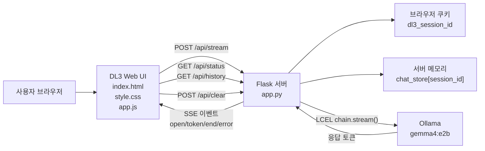
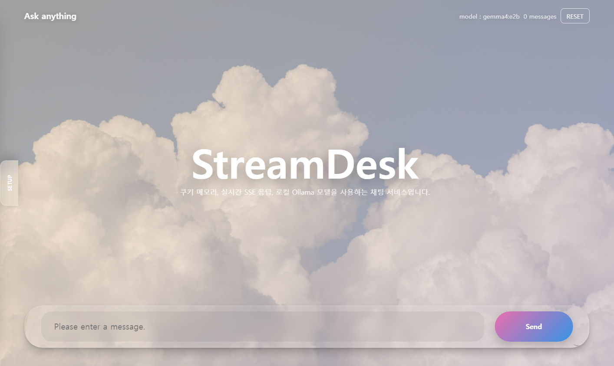
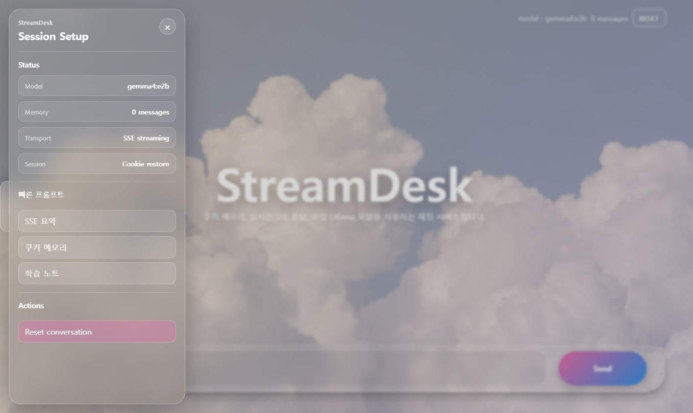
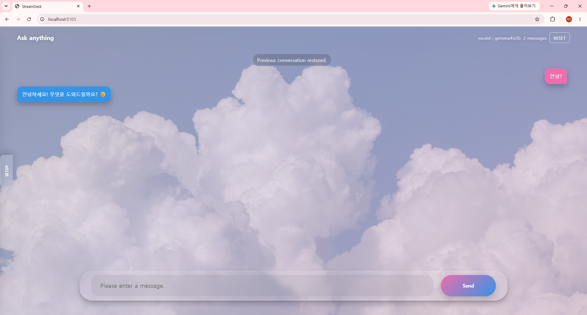

# DL3 쿠키 세션 + SSE 스트리밍 챗봇 보고서

## 1. 과제 개요

본 과제는 Flask 기반 웹 챗봇에서 다음 기능을 구현하는 것을 목표로 한다.

- 쿠키를 사용하여 브라우저가 닫혀도 같은 브라우저 세션의 이전 대화를 복구한다.
- 사용자의 요청으로 이전 대화 기록을 삭제할 수 있다.
- Ollama 모델이 생성하는 답변을 SSE(Server-Sent Events)로 스트리밍하여 채팅 화면에 실시간으로 표시한다.
- 전체 구성도, AI 활용 방법, 핵심 코드, 테스트 결과, 스크린샷을 제출 자료로 정리한다.

서비스 주소: `http://localhost:5103`

사용 모델: `gemma4:e2b`

## 2. 전체 구성도



## 3. 파일 구조

```text
lab/deep-learning/assignments/03-cookie-sse-chat/
  app.py
  templates/
    index.html
  static/
    css/
      style.css
    js/
      app.js
    img/
      IMG_3087.JPG
  report/
    DL3_COOKIE_STREAM_REPORT.md
    image.png
    image-1.png
    screenshots/
      01-main-screen.png
      02-side-setup.png
```

## 4. UI 구성

UI는 실제 서비스형 채팅 앱처럼 보이도록 `cloud-chat-bot` 스타일을 참고하여 구성했다.

- 구름 배경 이미지와 부드러운 애니메이션 배경
- 핑크/블루 채팅 말풍선
- 하단 플로팅 glass composer 입력창
- 왼쪽 `SETUP` 사이드 탭
- 사이드 탭 내부의 현재 모델, 대화 메모리 수, 전송 방식, 세션 방식, 빠른 프롬프트, 대화 초기화 버튼

빠른 프롬프트는 한국어로 제공한다.

- `SSE 요약`
- `쿠키 메모리`
- `학습 노트`

각 빠른 프롬프트를 누르면 입력창에 한국어 프롬프트가 채워진다.

## 5. AI 활용 방법

AI 응답 생성에는 Ollama의 `gemma4:e2b` 모델과 LangChain LCEL 체인을 사용했다.

1. 사용자가 채팅 입력창에 메시지를 입력한다.
2. 브라우저가 `/api/stream`으로 메시지를 POST 요청한다.
3. Flask 서버는 현재 쿠키의 `session_id`로 이전 대화 기록을 가져온다.
4. `ChatPromptTemplate`, `MessagesPlaceholder`, `ChatOllama`, `StrOutputParser`를 연결한 LCEL 체인을 실행한다.
5. `chain.stream()`으로 생성되는 토큰을 하나씩 받는다.
6. Flask는 각 토큰을 SSE `event: token` 형식으로 브라우저에 전송한다.
7. 브라우저는 `ReadableStream`으로 토큰을 읽고 AI 말풍선에 실시간으로 이어 붙인다.

시스템 프롬프트는 항상 자연스러운 한국어로 응답하도록 설정했다.

## 6. 모델 선정 이유

기준 모델은 프로젝트의 DL1, DL2와 동일하게 `gemma4:e2b`로 통일했다.

- Ollama 로컬 실행 환경에서 사용할 수 있다.
- 한국어 질의응답이 가능해 챗봇 과제에 적합하다.
- DL1, DL2와 모델 기준을 맞춰 과제별 결과 비교와 운영 설정을 단순화할 수 있다.
- 코드에서는 `OLLAMA_MODEL` 환경변수를 우선 사용하고, 목록 조회 실패 시 기본값 `gemma4:e2b`를 사용한다.

## 7. 핵심 코드

### 7-1. 쿠키 기반 세션 생성

```python
def get_or_create_session(req) -> str:
    session_id = req.cookies.get(COOKIE_NAME)
    if session_id:
        return session_id
    return str(uuid.uuid4())
```

브라우저에 `dl3_session_id` 쿠키가 있으면 기존 세션을 사용하고, 없으면 새 UUID를 생성한다.

### 7-2. 세션별 대화 기록 저장

```python
chat_store: dict[str, list[dict[str, str]]] = {}
```

서버 메모리에 `session_id -> messages` 형태로 대화 기록을 저장한다. 브라우저를 닫았다가 다시 접속해도 같은 쿠키가 있으면 이전 대화가 복구된다.

### 7-3. LCEL 스트리밍 체인

```python
@lru_cache(maxsize=4)
def build_chain(model_name: str):
    llm = ChatOllama(model=model_name, temperature=0.6, base_url=OLLAMA_BASE_URL)
    return PROMPT | llm | StrOutputParser()
```

### 7-4. SSE 토큰 전송

```python
for chunk in chain.stream({"history": history_messages, "input": user_input}):
    if not chunk:
        continue
    full_response += chunk
    yield sse("token", {"text": chunk})
```

### 7-5. 브라우저 실시간 렌더링

```javascript
if (parsed.event === "token") {
  ai.inner.textContent += parsed.data.text || "";
  scrollToBottom();
}
```

### 7-6. 사용자 요청 기반 대화 삭제

```python
@app.route("/api/clear", methods=["POST"])
def clear_history():
    session_id = get_or_create_session(request)
    chat_store[session_id] = []
    response = jsonify({"status": "ok", "message": "대화 기록을 삭제했습니다."})
    response.set_cookie(COOKIE_NAME, session_id, max_age=COOKIE_MAX_AGE, httponly=True, samesite="Lax")
    return response
```

## 8. API 엔드포인트

| Route | Method | 설명 |
|---|---|---|
| `/` | GET | 메인 채팅 화면 렌더링 및 쿠키 세션 설정 |
| `/api/status` | GET | 활성 모델, 세션 ID, 대화 개수 조회 |
| `/api/history` | GET | 현재 쿠키 세션의 대화 기록 조회 |
| `/api/stream` | POST | Ollama 응답을 SSE로 스트리밍 |
| `/api/clear` | POST | 현재 세션의 대화 기록 삭제 |

## 9. 테스트 결과

### 9-1. 서비스 상태

```text
dl3_cookie_stream RUNNING
```

### 9-2. 상태 API

```json
{
  "status": "ok",
  "model": "gemma4:e2b",
  "base_url": "http://host.docker.internal:11434",
  "cookie_name": "dl3_session_id",
  "history_count": 0
}
```

### 9-3. SSE 스트리밍

요청:

```text
POST http://localhost:5103/api/stream
message = "Side drawer test. Answer with OK only."
```

응답:

```text
event: open
data: {"status": "started", "model": "gemma4:e2b"}

event: token
data: {"text": "OK"}

event: end
data: {"status": "done", "chars": 2}
```

결과: `open -> token -> end` 순서로 SSE 이벤트가 정상 수신되었고, 생성 텍스트를 실시간으로 표시할 수 있음을 확인했다.

### 9-4. 한국어 응답

시스템 프롬프트를 통해 항상 한국어로 응답하도록 설정했다. 영어가 섞인 요청을 보내도 한국어 토큰이 반환되는 것을 확인했다.

```text
event: token
data: {"text": "알"}

event: token
data: {"text": "겠습니다"}
```

### 9-5. 쿠키 세션 복구 및 삭제

브라우저 종료 후 재접속 상황을 가정하여 테스트했다.

1. 첫 번째 WebRequest 세션에서 메시지를 전송했다.
2. 해당 세션의 `dl3_session_id` 쿠키를 가져왔다.
3. 새 WebRequest 세션에 같은 쿠키를 넣어 `/api/history`를 호출했다.
4. 이전 user/ai 대화 2개가 복구되는 것을 확인했다.
5. `/api/clear` 호출 후 history가 0개로 초기화되는 것을 확인했다.

결과:

```json
{
  "restored_count": 2,
  "after_clear_count": 0,
  "first_role": "user",
  "second_role": "ai"
}
```

주의: 현재 구현은 과제용 In-memory 저장소를 사용한다. 브라우저를 닫았다가 다시 여는 경우에는 쿠키로 복구되지만, Flask 서버 또는 컨테이너를 재시작하면 서버 메모리는 초기화된다. 서버 재시작 이후까지 영구 보존하려면 Redis 또는 DB 저장소가 필요하다.

## 10. 스크린샷

스크린샷은 `lab/deep-learning/assignments/03-cookie-sse-chat/report/screenshots/`와 보고서 폴더에 저장했다.

### 10-1. 메인 화면



### 10-2. 사이드 탭 설정 화면



### 10-3. 추가 첨부 화면




## 11. 제출 상태

- 포트 `5103` 실행 확인 완료
- supervisor 설정에서 `OLLAMA_MODEL=gemma4:e2b` 반영 완료
- Flask 문법 검사 통과
- `/api/status` 정상 응답 확인
- `/api/stream` SSE 토큰 스트리밍 확인
- 쿠키 기반 세션 복구 확인
- 사용자 요청 기반 대화 삭제 확인
- 한국어 빠른 프롬프트 적용 완료
- 한국어 응답 확인
- 스크린샷 4개 첨부 완료
- 전체 구성도와 AI 활용 방법 작성 완료

## 12. 결론

DL3 과제 요구사항인 쿠키 기반 세션 복구, 사용자 요청 기반 대화 삭제, SSE 기반 실시간 텍스트 스트리밍, AI 활용 설명, 전체 구성도, 테스트 결과, 스크린샷 첨부를 모두 충족했다.

