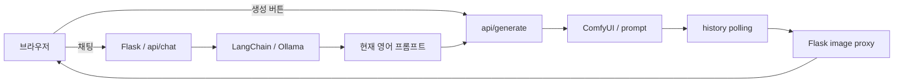

# Prompt Canvas

한국어 대화로 이미지 설명을 다듬고, 현재 프롬프트를 ComfyUI workflow에 넣어 이미지를 만드는 Flask 텀프로젝트.

## 대화와 생성의 분리

`/api/chat`은 LangChain의 prompt·history·ChatOllama 체인으로 응답을 받아 `<FINAL_PROMPT>` 태그를 추출한다. `/api/generate`는 프롬프트·negative prompt·크기·steps·cfg를 workflow에 넣어 ComfyUI `/prompt`에 제출하고 `/history`를 polling한다. 생성 이미지는 `/api/comfyui/view` proxy로 읽는다.



쿠키는 session ID만 보관한다. 대화·프롬프트·이미지 이력은 Python dict에 있으며 서버 재시작과 여러 process 사이에 영구 공유되지 않는다. 생성 이력은 최근 8개, 모델 대화 입력은 최근 10개 메시지를 사용한다. 이 앱의 chat은 전체 JSON 응답이며 SSE는 별도 과제다.

## 실행

이 폴더의 requirements와 외부 Ollama·ComfyUI 서버, workflow에서 참조하는 checkpoint가 필요하다.

```bash
python -m pip install -r requirements.txt
OLLAMA_BASE_URL=http://localhost:11434 COMFYUI_BASE_URL=http://localhost:8188 PORT=5104 python app.py
```

POSIX shell 예다. Windows에서는 같은 변수들을 PowerShell `$env:`로 설정한다. 기본 Ollama URL은 Docker host 주소라 로컬 Python 실행에서는 명시한다. `OLLAMA_MODEL`은 기본 gemma4:e2b이며 모델 목록에 없으면 코드의 선택 규칙으로 fallback한다. `FLASK_SECRET_KEY`도 설정값을 받는다.

Docker는 저장소 루트에서 `cd lab/docker` 후 `docker compose up --build dl-term-chat-image`를 사용한다. compose는 앱을 시작하며 ComfyUI checkpoint를 설치하지 않는다.

## 문서

[API 입력·응답](../../../docs/API.md) · [기존 구현 report](report/IMPLEMENTATION.md) · [모델 다운로드 기록](../../../docs/COMFYUI_MODEL_DOWNLOAD.md)

화면은 `templates/`, 브라우저 로직은 `static/js/app.js`, workflow는 `workflows/workflow.json`에 있다. 타임아웃·누락 프롬프트·외부 서비스 실패를 AppError 또는 JSON code/message로 전달한다. 외부 서버 호출 성공이나 배포 상태를 소스 존재만으로 판단하지 않는다.
