# DL Final - Prompt Canvas 구현 정리

## 목표

사용자가 채팅으로 이미지 요구사항을 입력하면 LangChain과 Ollama가 대화 내용을 반영해 최종 이미지 프롬프트를 업데이트한다. 사용자가 `그림생성` 버튼을 누르면 현재 프롬프트를 ComfyUI workflow에 넣어 이미지를 생성하고 웹 화면에 표시한다.

## 전체 처리 흐름

```mermaid
flowchart LR
    A["사용자 채팅 입력"] --> B["Flask /api/chat"]
    B --> C["LangChain ChatPromptTemplate"]
    C --> D["Ollama 로컬 LLM"]
    D --> E["현재 이미지 프롬프트 업데이트"]
    E --> F["웹 화면에 Current prompt 표시"]
    F --> G["그림생성 버튼"]
    G --> H["Flask /api/generate"]
    H --> I["ComfyUI workflow.json에 prompt 주입"]
    I --> J["ComfyUI API /prompt"]
    J --> K["/history polling"]
    K --> L["생성 이미지 표시"]
```



## 핵심 코드 스니펫

### LangChain 프롬프트 구성

```python
PROMPT = ChatPromptTemplate.from_messages(
    [
        ("system", SYSTEM_PROMPT),
        MessagesPlaceholder(variable_name="history"),
        ("human", "{input}"),
    ]
)
```

### LangChain + Ollama 체인

```python
llm = ChatOllama(
    model=model_name,
    temperature=0.4,
    base_url=OLLAMA_BASE_URL,
)
chain = PROMPT | llm | StrOutputParser()
```

### 대화로 최종 프롬프트 업데이트

```python
raw_answer = build_chain(active_model).invoke({
    "history": history_messages,
    "input": chain_input,
})
final_prompt = extract_final_prompt(raw_answer)
session["current_prompt"] = final_prompt
```

### ComfyUI workflow에 프롬프트 반영

```python
graph["6"]["inputs"]["text"] = positive
graph["7"]["inputs"]["text"] = negative
graph["3"]["inputs"]["seed"] = random.randint(1, 2**48)
```

## 구현 파일

- `lab/deep-learning/term-projects/chat-image-generator/app.py`: Flask 서버, LangChain/Ollama 대화 정리, ComfyUI 이미지 생성 API
- `lab/deep-learning/term-projects/chat-image-generator/templates/index.html`: 채팅, 현재 프롬프트, 이미지 결과 화면
- `lab/deep-learning/term-projects/chat-image-generator/static/js/app.js`: 채팅 전송, 그림생성 요청, 상태 표시
- `lab/deep-learning/term-projects/chat-image-generator/static/css/style.css`: `dl2`, `dl3` 분위기를 참고한 과제용 UI
- `lab/deep-learning/term-projects/chat-image-generator/workflows/workflow.json`: ComfyUI 기본 이미지 생성 workflow
- `supervisor/apps.conf`: Docker 컨테이너에서 5104 포트 Flask 앱 자동 실행

## 실행 주소

Docker 컨테이너 실행 후 브라우저에서 다음 주소로 접속한다.

```text
http://localhost:5104
```

