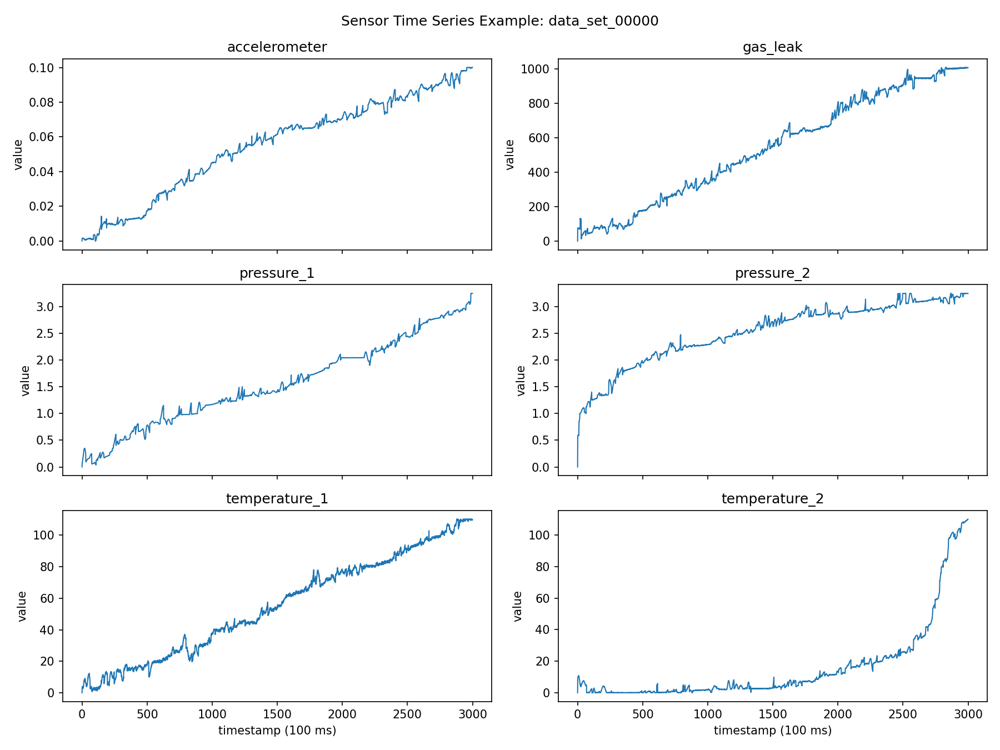
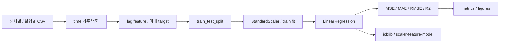

# 가스 누출량 예측 실험

6개 센서의 현재·과거 관측으로 3·9·30·60·120초 뒤 Gas_Leak 값을 예측하는 선형회귀 텀프로젝트.



## Dataset과 전처리

Accelerometer, Gas_Leak, Pressure_1/2, Temperature_1/2 폴더의 `센서_data_set_00001.csv` 형식을 읽는다. header 없는 time/value CSV를 실험 ID와 time 기준으로 병합하고 lag 0/10/30/60 step feature를 만든다. step은 0.1초 기준이며 horizon을 step으로 바꿔 target을 shift한다.



`train_models.py`는 행을 random split하고 test_size=0.2, random_state=42를 사용한다. 실험 단위 또는 시간 순서 split이 아니므로 인접 시계열 행의 분할이 평가에 영향을 줄 수 있다. scaler는 train에만 fit한다. 실서비스 예측 성능으로 일반화하지 않는다.

## 실행

이 폴더에서 환경을 준비한다.

```bash
python3 -m venv .venv
source .venv/bin/activate
python -m pip install -r requirements.txt
python src/train_models.py --limit-files 2
```

기본 dataset은 `lab/datasets/gas-leak-sample/`이다. 전체 센서 폴더를 사용할 때 `GAS_LEAK_DATASET_DIR`를 원본 경로로 지정한다. `--save-processed`는 horizon별 학습용 CSV도 저장한다.

출력은 `models/`의 bundle, `report/metrics.csv`·metrics.json·dataset_summary.csv와 figures, 선택한 `data/processed/`다. 재실행하면 같은 출력 파일을 덮어쓸 수 있다. 이번 문서 작업에서는 기존 실험 결과를 재생성하지 않았다.

## 결과와 코드

[기존 metrics](report/metrics.csv) · [구현 기록](report/implementation_notes.md) · [data_utils](src/data_utils.py) · [config](src/config.py)

기존 figures와 metrics는 저장된 실험 기록이다. 사용한 전체 dataset의 보관 상태와 재현 환경을 확인한 뒤 결과를 비교한다. API server, 온라인 센서 수집·모델 serving은 이 실험에 포함되어 있지 않다.
